# Module 8 Exercise - Data Storytelling

In this exercise, you will **create a data story product with a data set of your choosing**. You can choose any data set you can find on the Internet or a data set related to your current line of work. 


**You will create visualizations to give a message, make a point, or convince your audience by using all the techniques we have 
seen throughout the course.**

This exercise is about creating a quickly consumable product; Do **NOT** create a report or lengthy power point presentation. You can choose a **poster format** or **few slides** to tell your story (with a unique angle) from the conclusions you derive for the audience you have decided. 


Here is a list of your tasks:

1. Find a data set and upload it to your exercises folder in module 8. 

2. Write your R code **in THIS exercise notebook** to create your visualizations, and save them under the `exercises` folder.

3. Create a **narrative visualization document** using **any** software you want (Word, PowerPoint, Photoshop, Adobe, etc.) by **pasting your visualizations and creating all necessary elements** (captions, text annotations, layout, etc.) 

4. Save your end product as a **PDF FILE** and upload it to your exercises folder (**MAKE SURE TO NAME IT L8_Exercise.pdf**)

You should start with a clear message or angle in your mind for your audience, and filter and format your data accordingly, and create the visualizations that will **support that message**. 

You need to have **at least one major visualization, and a number of supporting smaller graphs (2, 3, or more)** in a nice layout. Make sure to have a **clean layout** they can follow, and **enough text annotations and captions** to make your message/point clear. 


Look at the **good and bad examples** in the lab notebook and consult the links. 

You can choose any type of visualization that you believe will be most **effective** for the type of data, characteristics of the data, visual tasks, and the message you have chosen. 

You will be graded by the quality of your visualizations and storytelling; **make sure to use every principle you have learned in this course.** 

---

Following is to show how to save a plot to a file: 


```r
# this is how you save a plot to a file
library(ggplot2)
library(scales)
library(RColorBrewer)

# comment this out to see the plot in the notebook 
# png(filename="myplot.png")

# your plot here..
# qplot(carat, price, data = diamonds)

# comment this out to see the plot in the notebook
# dev.off()
```

Make sure you have all axis labels set in R notebook before you save your plot. You can adjust width and height when saving your plots.  Here is a reference to png() function:
https://stat.ethz.ch/R-manual/R-devel/library/grDevices/html/png.html

**Activity:**


```r
# Read your data here; 

# Clean it up, reformat it, filter it, sort it, group it, etc.

# Create your visualizations and save them as png files, then prepare your final pdf document elsewhere

# <- ALL YOUR CODE BELOW THIS POINT ->

# I am going to organize my code into multiple cells for easier interpretation of the code.
```

## Step 0: Brief description of this dataset and the story I want to tell about it:

### Brief Description:
This is a dataset of copper-based pesticide applications that have been reported through programs in the California Department of Pesticide Regulation, namely the Pesticide Use Reporting system and the Pesticide Information Portal (PIP).  I queried data from the PIP for the years 2008 through 2018 (the most recent available) about the application of any pesticide for which copper is the main chemical ingredient.  These data has various attributes (see Step 2 below for more details), including which county the application was made in.  

### The Story:
My graduate research project is looking at the potential effects of copper-based pesticides on high elevation lake ecosystems in Sequoia National Park.  These pesticides can drift in regional winds from agricultural fields in the Central Valley to the high elevation mountains of the Sierra Nevada.  So, the story I aim to tell with this dataset is to first show the distribution and spatial patterns in copper-based pesticide applications throughout California at the county level (choropleth).  Then, I want to show how the application quanties have bene consistent over the last 11 years - there is no clear downward trend in use of these pesticides (line graph).  This is true at the state level and in the region that is spatially proximal to Sequoia National Park (the San Joaquin Valley Air Basin).  Within the San Joaquin Valley Air Basin, I want to show that these pesticides are applied seasonally - so there are not consistent, regular applications throughout the entire year (boxplot).  Finally, I also want to highlight which crops in the San Joaquin Valley Air Basin receive the greatest quantities of copper-based pesticides, year after year (bar graph).  With this combination of figures, I can illustrate the spatial and temporal trends of copper-based pesticide application in California over the last decade, highlight the potential negative effect that this may have on Sequoia National Park ecosystems due to the concentrated proximity of these pesticide applications, and show which crops provide the greatest use of these pesticides.  Thus, this 'one-pager' can answer a viewer's questions about "where are these pesticides applied?', 'have they always been applied at these rates?', 'when are they applied throughout the year?', 'what crops are they most likely use on?', and 'how do these patterns relate spatially to a protected area like Sequoia National Park?'.

## Step 1: Read in data, do some general clean-up and reformatting


```r
# Load tidyverse
library(tidyverse)
```

```
## ── Attaching packages ─────────────────────────────────────── tidyverse 1.3.2 ──
## ✔ tibble  3.1.8      ✔ dplyr   1.0.10
## ✔ tidyr   1.2.1      ✔ stringr 1.5.0 
## ✔ readr   2.1.3      ✔ forcats 0.5.2 
## ✔ purrr   0.3.5      
## ── Conflicts ────────────────────────────────────────── tidyverse_conflicts() ──
## ✖ readr::col_factor() masks scales::col_factor()
## ✖ purrr::discard()    masks scales::discard()
## ✖ dplyr::filter()     masks stats::filter()
## ✖ dplyr::lag()        masks stats::lag()
```


```r
# Read in data.  Note this is a very large dataset (108MB), over 750,000 rows in csv.
setwd("C:/Users/gidge/OneDrive - University of Missouri/PhD Thesis Files/Data/CDPR Copper")
copper <- read.csv("CalPIP_Cu_2008-2018.csv")
dim(copper)
```

```
## [1] 759363     17
```


```r
# This code chunk is here as a check on the filtering of SITE_NAME.  Here I'm just calculating how many rows should remain
# in the dataframe after I remove the site names that I do not want to include.
# First, I create a new dataframe called 'sites' that includes the counts of all the different site names.  This helped me
# identify which ones to remove in the next code chunk.
# Then, I use piping to calculate how many rows should remain in the 'copper' dataframe after I remove the site names I want
# to exclude.

sites <- copper %>% count(SITE_NAME)
# print(SITES, n = Inf)

sites %>% filter(SITE_NAME != "" & 
                   SITE_NAME != "AIRPORTS AND LANDING FIELDS (RUNWAYS, ETC.)" & 
                   SITE_NAME != "ANTIFOULING TREATMENT SITES (ALL OR UNSPEC)" & 
                   SITE_NAME != "AQUATIC AREAS, WATER AREAS (ALL OR UNSPEC)" & 
                   SITE_NAME != "AQUATIC SITE - INDUSTRIAL USE (COMBINED SITE)" & 
                   SITE_NAME != "BUILDINGS AND STRUCTURES (NON-AG OUTDOOR)" & 
                   SITE_NAME != "COMMODITY FUMIGATION" & 
                   SITE_NAME != "COUNTY AG. COMM. SALES" & 
                   SITE_NAME != "FUMIGATION, OTHER" & 
                   SITE_NAME != "HUMAN DRINKING WATER SYSTEMS (POTABLE)" & 
                   SITE_NAME != "INDUSTRIAL PROCESSING WATER" & 
                   SITE_NAME != "INDUSTRIAL WASTE DISPOSAL SYSTEMS, DISPOSAL WATER" & 
                   SITE_NAME != "IRRIGATION SYSTEMS (DITCHES, CANAL BANKS, ETC.)" & 
                   SITE_NAME != "LANDSCAPE MAINTENANCE" & 
                   SITE_NAME != "N-GRNHS GRWN CUT FLWRS OR GREENS" & 
                   SITE_NAME != "N-GRNHS GRWN PLANTS IN CONTAINERS" & 
                   SITE_NAME != "N-GRNHS GRWN TRNSPLNT/PRPGTV MTRL" & 
#                    SITE_NAME != "N-OUTDR CONTAINER/FLD GRWN PLANTS" & 
#                    SITE_NAME != "N-OUTDR GRWN CUT FLWRS OR GREENS" & 
#                    SITE_NAME != "N-OUTDR GRWN TRNSPLNT/PRPGTV MTRL " & 
                   SITE_NAME != "ORNAMENTAL TURF (ALL OR UNSPEC)" & 
                   SITE_NAME != "PUBLIC HEALTH PEST CONTROL" & 
                   SITE_NAME != "RECREATIONAL AREAS, TENNIS COURTS, PARKS, ETC." & 
                   SITE_NAME != "REGULATORY PEST CONTROL" & 
                   SITE_NAME != "RESEARCH COMMODITY" & 
                   SITE_NAME != "RIGHTS OF WAY" & 
#                    SITE_NAME != "SOIL APPLICATION, PREPLANT-OUTDOOR (SEEDBEDS,ETC.)" & 
                   SITE_NAME != "STRUCTURAL PEST CONTROL" & 
                   SITE_NAME != "TURF, GOLF COURSE (FAIRWAYS, GREENS, ROUGH)" & 
#                    SITE_NAME != "UNCULTIVATED AGRICULTURAL AREAS (ALL OR UNSPEC)" & 
                   SITE_NAME != "UNCULTIVATED NON-AG AREAS (ALL OR UNSPEC)" & 
                   SITE_NAME != "VERTEBRATE PEST CONTROL" & 
                   SITE_NAME != "WOOD PROTECTION TREATMENTS (ALL OR UNSPECIFIED)") %>%
summarize(n = sum(n))
```

```
##        n
## 1 691173
```

```r
# after filtering the sites, there are 691173 rows.
```


```r
# clean up, reformat, filter, sort, group, etc.
head(copper)
```

```
##   ADJUVANT YEAR     DATE COUNTY_NAME      COMTRS             SITE_NAME
## 1       NO 2018 01-06-18   CALAVERAS          05 LANDSCAPE MAINTENANCE
## 2       NO 2018 14-04-18        NAPA 28M09N06W32          GRAPES, WINE
## 3       NO 2018 14-04-18        NAPA 28M09N06W32          GRAPES, WINE
## 4       NO 2018 27-04-18        NAPA 28M08N05W05          GRAPES, WINE
## 5       NO 2018 01-06-18       MARIN          21 LANDSCAPE MAINTENANCE
## 6       NO 2018 01-06-18       MARIN          21 LANDSCAPE MAINTENANCE
##    PRODUCT_NAME POUNDS_PRODUCT_APPLIED      CHEMICAL_NAME
## 1 49'ER BONANZA                  1e-04      COPPER OLEATE
## 2      BADGE X2                  1e-02   COPPER HYDROXIDE
## 3      BADGE X2                  1e-02 COPPER OXYCHLORIDE
## 4  NORDOX 75 WG                  1e-02 COPPER OXIDE (OUS)
## 5      BADGE X2                  1e-02   COPPER HYDROXIDE
## 6      BADGE X2                  1e-02 COPPER OXYCHLORIDE
##   POUNDS_CHEMICAL_APPLIED AMOUNT_TREATED UNIT_TREATED AERIAL_GROUND_INDICATOR
## 1               1.525e-05             NA                                     
## 2               2.149e-03           0.02            A                       G
## 3               2.382e-03           0.02            A                       G
## 4               8.390e-03           0.01            A                       G
## 5               2.149e-03             NA                                     
## 6               2.382e-03             NA                                     
##   AERIAL_GROUND_DESCRIPTION AMOUNT_PRODUCT_APPLIED APPLICATION_MONTH
## 1                   UNKNOWN                  0.001              JUNE
## 2                    GROUND                  0.010             APRIL
## 3                    GROUND                  0.010             APRIL
## 4                    GROUND                  0.010             APRIL
## 5                   UNKNOWN                  0.010              JUNE
## 6                   UNKNOWN                  0.010              JUNE
##   CHEMICAL_CODE
## 1           154
## 2           151
## 3           156
## 4           175
## 5           151
## 6           156
```


```r
# remove unnecessary columns
copper <- copper[ ,-c(1, 3, 5, 13, 14, 17)]

# remove applications that aren't of interest here (SITE_NAME column).  I'm only interested in agriculturally-linked
# applications.  So, I decided to keep things like outdoor grown cut flowers and greens, and preplanting soil applications
# because these are still related to and part of agricultural actions.
copper <- copper %>% 
            filter(SITE_NAME != "" & 
                   SITE_NAME != "AIRPORTS AND LANDING FIELDS (RUNWAYS, ETC.)" & 
                   SITE_NAME != "ANTIFOULING TREATMENT SITES (ALL OR UNSPEC)" & 
                   SITE_NAME != "AQUATIC AREAS, WATER AREAS (ALL OR UNSPEC)" & 
                   SITE_NAME != "AQUATIC SITE - INDUSTRIAL USE (COMBINED SITE)" & 
                   SITE_NAME != "BUILDINGS AND STRUCTURES (NON-AG OUTDOOR)" & 
                   SITE_NAME != "COMMODITY FUMIGATION" & 
                   SITE_NAME != "COUNTY AG. COMM. SALES" & 
                   SITE_NAME != "FUMIGATION, OTHER" & 
                   SITE_NAME != "HUMAN DRINKING WATER SYSTEMS (POTABLE)" & 
                   SITE_NAME != "INDUSTRIAL PROCESSING WATER" & 
                   SITE_NAME != "INDUSTRIAL WASTE DISPOSAL SYSTEMS, DISPOSAL WATER" & 
                   SITE_NAME != "IRRIGATION SYSTEMS (DITCHES, CANAL BANKS, ETC.)" & 
                   SITE_NAME != "LANDSCAPE MAINTENANCE" & 
                   SITE_NAME != "N-GRNHS GRWN CUT FLWRS OR GREENS" & 
                   SITE_NAME != "N-GRNHS GRWN PLANTS IN CONTAINERS" & 
                   SITE_NAME != "N-GRNHS GRWN TRNSPLNT/PRPGTV MTRL" & 
#                    SITE_NAME != "N-OUTDR CONTAINER/FLD GRWN PLANTS" & 
#                    SITE_NAME != "N-OUTDR GRWN CUT FLWRS OR GREENS" & 
#                    SITE_NAME != "N-OUTDR GRWN TRNSPLNT/PRPGTV MTRL " & 
                   SITE_NAME != "ORNAMENTAL TURF (ALL OR UNSPEC)" & 
                   SITE_NAME != "PUBLIC HEALTH PEST CONTROL" & 
                   SITE_NAME != "RECREATIONAL AREAS, TENNIS COURTS, PARKS, ETC." & 
                   SITE_NAME != "REGULATORY PEST CONTROL" & 
                   SITE_NAME != "RESEARCH COMMODITY" & 
                   SITE_NAME != "RIGHTS OF WAY" & 
#                    SITE_NAME != "SOIL APPLICATION, PREPLANT-OUTDOOR (SEEDBEDS,ETC.)" & 
                   SITE_NAME != "STRUCTURAL PEST CONTROL" & 
                   SITE_NAME != "TURF, GOLF COURSE (FAIRWAYS, GREENS, ROUGH)" & 
#                    SITE_NAME != "UNCULTIVATED AGRICULTURAL AREAS (ALL OR UNSPEC)" & 
                   SITE_NAME != "UNCULTIVATED NON-AG AREAS (ALL OR UNSPEC)" & 
                   SITE_NAME != "VERTEBRATE PEST CONTROL" & 
                   SITE_NAME != "WOOD PROTECTION TREATMENTS (ALL OR UNSPECIFIED)")

dim(copper)
```

```
## [1] 691173     11
```


```r
sum(is.na(copper$POUNDS_CHEMICAL_APPLIED))
```

```
## [1] 54
```

```r
sum(is.na(copper$APPLICATION_MONTH))
```

```
## [1] 0
```

```r
sum(copper$APPLICATION_MONTH == "")
```

```
## [1] 18
```

```r
# sum(copper$POUNDS_CHEMICAL_APPLIED == "")

# There are some NA or blank values in these columns, so, I'm going to remove these:
copper <- copper %>% 
            filter(!is.na(POUNDS_CHEMICAL_APPLIED)) 

copper <- copper %>% 
            filter(copper$APPLICATION_MONTH != "")


dim(copper) # This is a check for myself
```

```
## [1] 691101     11
```


```r
# Ensuring that there is data for every county so that I can actually create a choropleth

copper$COUNTY_NAME <- factor(copper$COUNTY_NAME)
levels(copper$COUNTY_NAME)
```

```
##  [1] "ALAMEDA"         "AMADOR"          "BUTTE"           "CALAVERAS"      
##  [5] "COLUSA"          "CONTRA COSTA"    "DEL NORTE"       "EL DORADO"      
##  [9] "FRESNO"          "GLENN"           "HUMBOLDT"        "IMPERIAL"       
## [13] "KERN"            "KINGS"           "LAKE"            "LASSEN"         
## [17] "LOS ANGELES"     "MADERA"          "MARIN"           "MARIPOSA"       
## [21] "MENDOCINO"       "MERCED"          "MODOC"           "MONTEREY"       
## [25] "NAPA"            "NEVADA"          "ORANGE"          "PLACER"         
## [29] "RIVERSIDE"       "SACRAMENTO"      "SAN BENITO"      "SAN BERNARDINO" 
## [33] "SAN DIEGO"       "SAN JOAQUIN"     "SAN LUIS OBISPO" "SAN MATEO"      
## [37] "SANTA BARBARA"   "SANTA CLARA"     "SANTA CRUZ"      "SHASTA"         
## [41] "SISKIYOU"        "SOLANO"          "SONOMA"          "STANISLAUS"     
## [45] "SUTTER"          "TEHAMA"          "TRINITY"         "TULARE"         
## [49] "TUOLUMNE"        "VENTURA"         "YOLO"            "YUBA"
```

```r
# After removing the SITE_NAME examples that I don't want to include in this dataset, some of the Counties are also gone.
# Alpine: had no copper-pesticide applications recorded 2008-2018
# Inyo: only had Rights of Way, Landscape Maintenance, Structural Pest Control
# Mono: only had Rights of Way
# Plumas: only had Rights of Way, Landscape Maintenance, Structural Pest Control, Uncultivated Non-Ag Areas (All or Unspec)
# San Francisco: only had Rights of Way, Landscape Maintenance, Structural Pest Control
# Sierra: only had Rights of Wat, Structural Pest Control

# So I need to add values of zero for each of these County-Year combinations
# Note that I want to use ZERO and not NA values because data were collected, but there were ZERO pounds of copper-based
# pesticides applied in agricultural applications.  (Because I've removed applications that are not agricultural.)

CountyNAs <- expand.grid(c(2008:2018),
                         c("ALPINE", "INYO", "MONO", "PLUMAS", "SAN FRANCISCO", "SIERRA"),
                         c(as.double(0)))

# names(copper)
CountyNAs <- CountyNAs %>% rename(YEAR = Var1, COUNTY_NAME = Var2, POUNDS_CHEMICAL_APPLIED = Var3)
head(CountyNAs)
```

```
##   YEAR COUNTY_NAME POUNDS_CHEMICAL_APPLIED
## 1 2008      ALPINE                       0
## 2 2009      ALPINE                       0
## 3 2010      ALPINE                       0
## 4 2011      ALPINE                       0
## 5 2012      ALPINE                       0
## 6 2013      ALPINE                       0
```

```r
dim(CountyNAs)
```

```
## [1] 66  3
```

```r
# Now add these NA values to the copper dataframe
# because binding 
copper <- copper %>% 
            bind_rows(CountyNAs)

dim(copper) # should be, and is, 691167 rows.
```

```
## [1] 691167     11
```


```r
# Clean up the uppercases stuff everywhere (in the row values, not the columns) to Title Case
# Keep everything as factor variables
# For month, establish order of the months
copper$APPLICATION_MONTH <- factor(str_to_title(copper$APPLICATION_MONTH),
                                  levels = c("January", "February", "March", "April", "May", "June", 
                                             "July", "August", "September", "October", "November", "December"))
copper$COUNTY_NAME <- factor(str_to_title(copper$COUNTY_NAME))
copper$CHEMICAL_NAME <- factor(str_to_title(copper$CHEMICAL_NAME))
copper$SITE_NAME <- factor(str_to_title(copper$SITE_NAME))
copper$PRODUCT_NAME <- factor(str_to_title(copper$PRODUCT_NAME))

head(copper)
```

```
##   YEAR COUNTY_NAME    SITE_NAME PRODUCT_NAME POUNDS_PRODUCT_APPLIED
## 1 2018        Napa Grapes, Wine     Badge X2                 0.0100
## 2 2018        Napa Grapes, Wine     Badge X2                 0.0100
## 3 2018        Napa Grapes, Wine Nordox 75 Wg                 0.0100
## 4 2018        Napa Grapes, Wine Nordox 75 Wg                 0.0100
## 5 2018      Merced       Tomato   Nu-Cop Xlr                 0.0983
## 6 2018      Merced       Tomato   Nu-Cop Xlr                 0.0983
##        CHEMICAL_NAME POUNDS_CHEMICAL_APPLIED AMOUNT_TREATED UNIT_TREATED
## 1   Copper Hydroxide              0.00214900           0.02            A
## 2 Copper Oxychloride              0.00238200           0.02            A
## 3 Copper Oxide (Ous)              0.00839000           0.01            A
## 4 Copper Oxide (Ous)              0.00839000           0.01            A
## 5   Copper Hydroxide              0.01676998           0.03            A
## 6   Copper Hydroxide              0.01676998           0.03            A
##   AMOUNT_PRODUCT_APPLIED APPLICATION_MONTH
## 1                   0.01             April
## 2                   0.01             April
## 3                   0.01             April
## 4                   0.01               May
## 5                   0.01         September
## 6                   0.01         September
```

## Step 2: Explore the data, create preliminary figures to understand different ways to look at the dataset, and help decide which trends will be best to tell the data's story


```r
# General Exploration of the Dataframe
summary(copper)
```

```
##       YEAR           COUNTY_NAME    
##  Min.   :2008   Tulare     :113283  
##  1st Qu.:2011   Fresno     : 87555  
##  Median :2014   Kern       : 52689  
##  Mean   :2013   Monterey   : 40964  
##  3rd Qu.:2016   Stanislaus : 38228  
##  Max.   :2018   San Joaquin: 29906  
##                 (Other)    :328542  
##                                    SITE_NAME     
##  Grapes, Wine                           :114425  
##  Walnut (English Walnut, Persian Walnut):100229  
##  Grapes                                 : 87718  
##  Orange (All Or Unspec)                 : 80982  
##  Almond                                 : 37880  
##  (Other)                                :269867  
##  NA's                                   :    66  
##                                    PRODUCT_NAME    POUNDS_PRODUCT_APPLIED
##  Dupont Kocide 3000 Fungicide/Bactericide: 95841   Min.   :    0.0       
##  Badge X2                                : 83436   1st Qu.:   15.0       
##  Nordox 75 Wg                            : 55538   Median :   52.0       
##  Basic Copper 53                         : 46842   Mean   :  156.8       
##  Nu-Cop 50df                             : 43938   3rd Qu.:  150.0       
##  (Other)                                 :365506   Max.   :32603.0       
##  NA's                                    :    66   NA's   :66            
##                 CHEMICAL_NAME    POUNDS_CHEMICAL_APPLIED AMOUNT_TREATED    
##  Copper Hydroxide      :367773   Min.   :    0.000       Min.   :     0.0  
##  Copper Sulfate (Basic):122061   1st Qu.:    5.456       1st Qu.:     6.9  
##  Copper Oxychloride    : 69986   Median :   24.640       Median :    18.0  
##  Copper Oxide (Ous)    : 66797   Mean   :   84.152       Mean   :   570.4  
##  Copper Octanoate      : 28496   3rd Qu.:   75.547       3rd Qu.:    40.0  
##  (Other)               : 35988   Max.   :22639.200       Max.   :379390.0  
##  NA's                  :    66                           NA's   :71        
##  UNIT_TREATED       AMOUNT_PRODUCT_APPLIED APPLICATION_MONTH
##  Length:691167      Min.   :     0.0       April   :186113  
##  Class :character   1st Qu.:    13.5       March   : 86209  
##  Mode  :character   Median :    50.0       May     : 74976  
##                     Mean   :   163.6       January : 74595  
##                     3rd Qu.:   150.0       November: 67921  
##                     Max.   :362496.0       (Other) :201287  
##                     NA's   :66             NA's    :    66
```

```r
# Most number of applications made in Tulare county.
# Most number of applications made on wine grapes (114425) and then walnuts (100229).
# Most common chemicals applied are copper hydroxide (367773), then copper sulfate (basic) (122061).
# Most common months of application are April (186113 applications), then March (86209).
```


```r
# Now I can create summarizing dataframes that reformat and group the data in a way that I can use more readily
# for different visualizations.  Using these kinds of summarized dataframes will help with processing speeds too.

# First, I'll make a dataframe that summarizes POUNDS_CHEMICAL_APPLIED by year, month, and county
yrMonCounty <- copper %>%
                group_by(YEAR, APPLICATION_MONTH, COUNTY_NAME) %>%
                summarize(TotalPoundsChemAppl = sum(POUNDS_CHEMICAL_APPLIED))
```

```
## `summarise()` has grouped output by 'YEAR', 'APPLICATION_MONTH'. You can
## override using the `.groups` argument.
```

```r
head(yrMonCounty)
```

```
## # A tibble: 6 × 4
## # Groups:   YEAR, APPLICATION_MONTH [1]
##    YEAR APPLICATION_MONTH COUNTY_NAME  TotalPoundsChemAppl
##   <int> <fct>             <fct>                      <dbl>
## 1  2008 January           Butte                 10791.    
## 2  2008 January           Colusa                  374.    
## 3  2008 January           Contra Costa           1248.    
## 4  2008 January           Fresno               166257.    
## 5  2008 January           Glenn                  3023.    
## 6  2008 January           Humboldt                  0.0505
```

```r
# A dataframe that summarizes by year, month, county, chemical name, and crop

yrMonCountyChemCrop <- copper %>%
                        group_by(YEAR, APPLICATION_MONTH, COUNTY_NAME, CHEMICAL_NAME, SITE_NAME) %>%
                        summarize(TotalPoundsChemAppl = sum(POUNDS_CHEMICAL_APPLIED))
```

```
## `summarise()` has grouped output by 'YEAR', 'APPLICATION_MONTH', 'COUNTY_NAME',
## 'CHEMICAL_NAME'. You can override using the `.groups` argument.
```

```r
head(yrMonCountyChemCrop)
```

```
## # A tibble: 6 × 6
## # Groups:   YEAR, APPLICATION_MONTH, COUNTY_NAME, CHEMICAL_NAME [3]
##    YEAR APPLICATION_MONTH COUNTY_NAME CHEMICAL_NAME          SITE_NAME   Total…¹
##   <int> <fct>             <fct>       <fct>                  <fct>         <dbl>
## 1  2008 January           Butte       Copper Hydroxide       Almond       211.  
## 2  2008 January           Butte       Copper Hydroxide       Peach         32.7 
## 3  2008 January           Butte       Copper Hydroxide       Prune       2009.  
## 4  2008 January           Butte       Copper Sulfate (Basic) Peach       8538.  
## 5  2008 January           Colusa      Copper Hydroxide       Cabbage        5.19
## 6  2008 January           Colusa      Copper Hydroxide       Onion (Dry…  369.  
## # … with abbreviated variable name ¹​TotalPoundsChemAppl
```

```r
yrMonCountyChemCrop[yrMonCountyChemCrop$COUNTY_NAME == "Alpine",]
```

```
## # A tibble: 11 × 6
## # Groups:   YEAR, APPLICATION_MONTH, COUNTY_NAME, CHEMICAL_NAME [11]
##     YEAR APPLICATION_MONTH COUNTY_NAME CHEMICAL_NAME SITE_NAME TotalPoundsChem…¹
##    <int> <fct>             <fct>       <fct>         <fct>                 <dbl>
##  1  2008 <NA>              Alpine      <NA>          <NA>                      0
##  2  2009 <NA>              Alpine      <NA>          <NA>                      0
##  3  2010 <NA>              Alpine      <NA>          <NA>                      0
##  4  2011 <NA>              Alpine      <NA>          <NA>                      0
##  5  2012 <NA>              Alpine      <NA>          <NA>                      0
##  6  2013 <NA>              Alpine      <NA>          <NA>                      0
##  7  2014 <NA>              Alpine      <NA>          <NA>                      0
##  8  2015 <NA>              Alpine      <NA>          <NA>                      0
##  9  2016 <NA>              Alpine      <NA>          <NA>                      0
## 10  2017 <NA>              Alpine      <NA>          <NA>                      0
## 11  2018 <NA>              Alpine      <NA>          <NA>                      0
## # … with abbreviated variable name ¹​TotalPoundsChemAppl
```

TO-DO LIST:
- clean up comments in code cells
- add a code chunk before starting to make summarizing code chunks that is just an overall view of the dataframe with descriptive stats
- consider some histograms

Plots to Consider:
- choropleths: 
    1) total chemical applied by county, 
        i) average or  median across all years 2008-2018
        ii) or just do 2018
    2) total chemical applied by county, faceted by year
    3) total chemical applied only for 4 counties most important to project?  **Or outline these in RED**
        i) try to get outline of Sequoia/Kings Canyon NP?
- boxplot of total chemical applied, faceted by chemical name (include each year point on top of boxplot with alpha)
- line graph of total chemical applied (sum all chemicals) over time
- boxplot of total chemical applied, faceted by crop
    - or do a histogram first of total chemical applied by crop, faceted by year (this is to see what's going on, not to use because there would be way too many categories)
    - e.g., if TONS of chemical are used on grapes, could call this out as an individual thing?
    - could result in a choropleth that shows what percent of each county's total chemical applied is applied on grapes
    - also think of this for the counties of interest - what crop are chemicals MOST used on in these counties specifically?


```r
# Overview histograms to explore the data a little bit
# This will help me narrow in on what story I want to tell with this dataset

# Histogram of total chem applied by chemical
yrMonCountyChemCrop %>% 
    drop_na(CHEMICAL_NAME) %>%
    group_by(CHEMICAL_NAME) %>% 
    summarize(TotalPounds = sum(TotalPoundsChemAppl)) %>% 
    arrange(desc(TotalPounds)) %>%
    ggplot(aes(x = reorder(CHEMICAL_NAME, TotalPounds), y = TotalPounds)) +
        geom_bar(stat = "identity") +
        coord_flip() +
        theme_minimal()
```

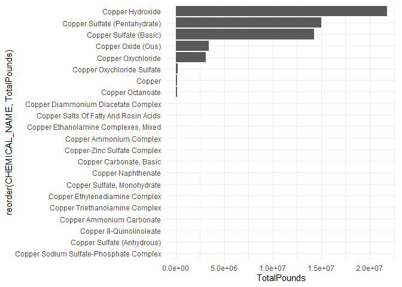<!-- -->

```r
# Some of these values are so small that they're not visible: log axis helps display them
yrMonCountyChemCrop %>% 
    drop_na(CHEMICAL_NAME) %>%
    group_by(CHEMICAL_NAME) %>% 
    summarize(TotalPounds = sum(TotalPoundsChemAppl)) %>% 
    arrange(desc(TotalPounds)) %>%
    ggplot(aes(x = reorder(CHEMICAL_NAME, TotalPounds), y = TotalPounds)) +
        geom_bar(stat = "identity") +
        coord_flip() +
        theme_minimal() + 
        scale_y_log10()
```

<!-- -->


```r
# Overview histograms to explore the data a little bit
# This will help me narrow in on what story I want to tell with this dataset

# Histogram of total chem applied by county
yrMonCounty %>%
    group_by(COUNTY_NAME, YEAR) %>%
    summarize(TotalPounds = sum(TotalPoundsChemAppl)) %>%
    ggplot(aes(x = reorder(COUNTY_NAME, TotalPounds), y = TotalPounds)) +
    geom_bar(stat = "identity") +
    coord_flip() +
    theme_minimal()
```

```
## `summarise()` has grouped output by 'COUNTY_NAME'. You can override using the
## `.groups` argument.
```

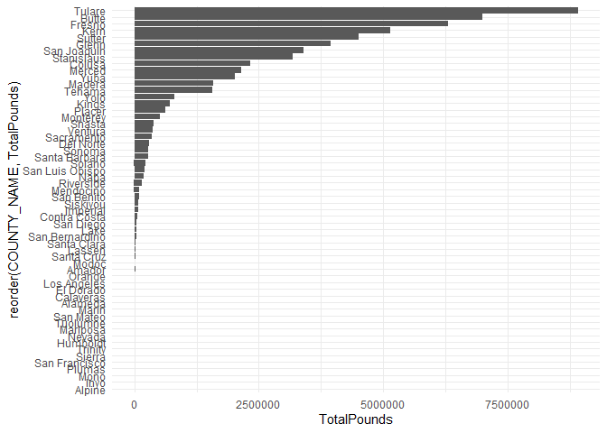<!-- -->

```r
# Histogram of total chem applied by county, faceted by year
# yrMonCounty %>%
#     group_by(COUNTY_NAME, YEAR) %>%
#     summarize(TotalPounds = sum(TotalPoundsChemAppl)) %>%
#     top_n(COUNTY_NAME, n = 10) %>%

# This shows the top 10 counties with greatest TotalPoundsChemAppl each year
# Note that all counties are kept in every facet.  This is because not all years have the same top10 counties.  If I 
# removed the counties not in the top 10 for each individual year, then each facet would need the y-axis labeled everytime.
# That would be messy too.  
# The main point here is that the top 10 counties are similar across year, although there is some variation.
yrMonCounty %>%
    group_by(COUNTY_NAME, YEAR) %>%
    summarize(TotalPounds = sum(TotalPoundsChemAppl)) %>%
    group_by(YEAR) %>%
    top_n(TotalPounds, n = 10) %>%
    ggplot(aes(x = reorder(COUNTY_NAME, TotalPounds), y = TotalPounds)) +
    geom_bar(stat = "identity") +
    coord_flip() +
    facet_wrap(. ~ YEAR) +
    theme_minimal() +
    theme(axis.text.x = element_text(angle = 90))
```

```
## `summarise()` has grouped output by 'COUNTY_NAME'. You can override using the
## `.groups` argument.
```

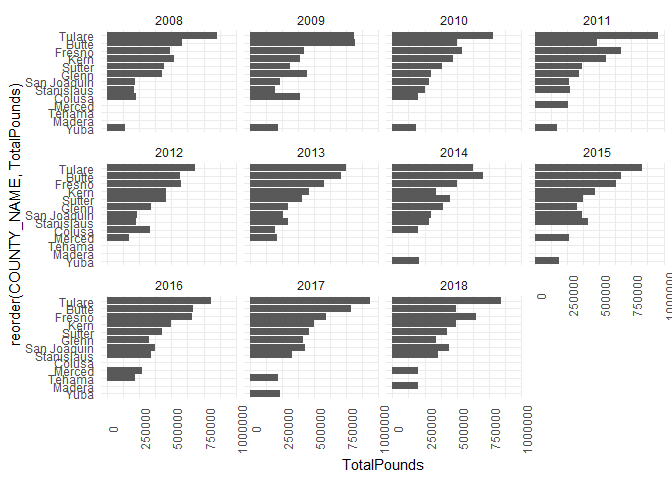<!-- -->


```r
# Overview histograms to explore the data a little bit
# This will help me narrow in on what story I want to tell with this dataset

# head(yrMonCountyChemCrop)
# Histogram of total chem applied by crop.  All crops shown here - hard to see.
yrMonCountyChemCrop %>%
    drop_na(SITE_NAME) %>%
    group_by(SITE_NAME, YEAR) %>%
    summarize(TotalPounds = sum(TotalPoundsChemAppl)) %>%
    top_n(TotalPounds, n = 25) %>%
    ggplot(aes(x = reorder(SITE_NAME, TotalPounds), y = TotalPounds)) +
    geom_bar(stat = "identity") +
    coord_flip() +
    theme_minimal()
```

```
## `summarise()` has grouped output by 'SITE_NAME'. You can override using the
## `.groups` argument.
```

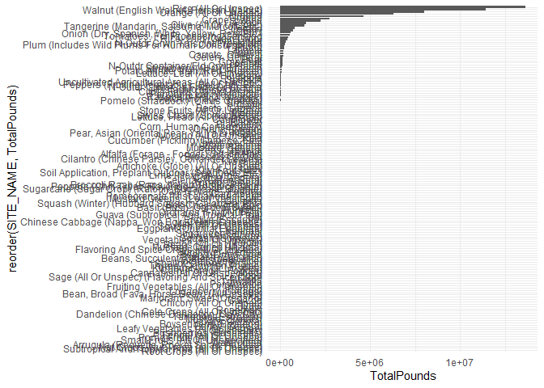<!-- -->

```r
# Histogram of total chem applied by crop, hard to see all of them in one graph, so I did top 15
yrMonCountyChemCrop %>%
    drop_na(SITE_NAME) %>%
    group_by(SITE_NAME, YEAR) %>%
    summarize(TotalPounds = sum(TotalPoundsChemAppl)) %>%
#     group_by(SITE_NAME) %>%
#     summarize(AllYrsTotal = sum(TotalPounds)) %>%
#     top_n(AllYrsTotal, n = 15) %>%
    filter(median(TotalPounds) >= 250000) %>%
    ggplot(aes(x = reorder(SITE_NAME, TotalPounds), y = TotalPounds)) + 
    geom_boxplot() +
#     geom_bar(stat = "identity") +
    coord_flip() +
    theme_minimal()
```

```
## `summarise()` has grouped output by 'SITE_NAME'. You can override using the
## `.groups` argument.
```

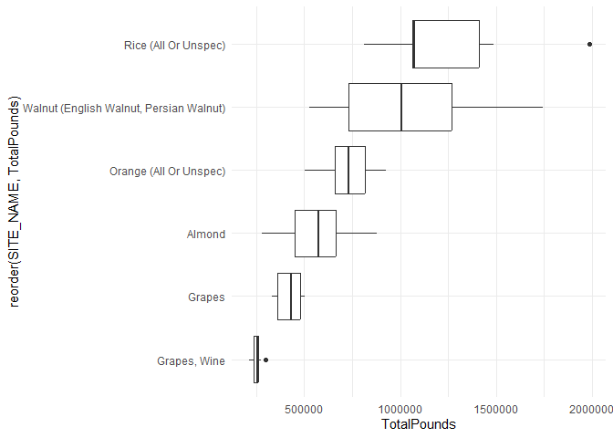<!-- -->

```r
# Dataframe of total chem applied by crop, faceted by year.  Top ten crops per year only.
yrMonCountyChemCrop[yrMonCountyChemCrop$COUNTY_NAME == "Fresno" & yrMonCountyChemCrop$YEAR == 2018,] %>%
    group_by(SITE_NAME, YEAR) %>%
    summarize(TotalPounds = sum(TotalPoundsChemAppl)) %>%
    group_by(YEAR) %>%
    top_n(TotalPounds, n = 10) %>%
    arrange(TotalPounds)
```

```
## `summarise()` has grouped output by 'SITE_NAME'. You can override using the
## `.groups` argument.
```

```
## # A tibble: 10 × 3
## # Groups:   YEAR [1]
##    SITE_NAME                                         YEAR TotalPounds
##    <fct>                                            <int>       <dbl>
##  1 Lemon                                             2018       8842.
##  2 Plum (Includes Wild Plums For Human Consumption)  2018      11202.
##  3 Olive (All Or Unspec)                             2018      11238.
##  4 Peach                                             2018      13686.
##  5 Onion (Dry, Spanish, White, Yellow, Red, Etc.)    2018      18093.
##  6 Tangerine (Mandarin, Satsuma, Murcott, Etc.)      2018      47662.
##  7 Grapes, Wine                                      2018      50145.
##  8 Grapes                                            2018      96685.
##  9 Orange (All Or Unspec)                            2018     108314.
## 10 Almond                                            2018     234342.
```

```r
# This shows the top 5 crops with greatest TotalPoundsChemAppl each year
# Note that all crops are kept in every facet.  This is because not all years have the same top 5 crops.  If I 
# removed the crops not in the top 5 for each individual year, then each facet would need the y-axis labeled every time.
# That would be messy too.  
# The main point here is that the top 5 crops are similar across year, although there is some variation.
yrMonCountyChemCrop %>%
    drop_na(SITE_NAME) %>%
    group_by(SITE_NAME, YEAR) %>%
    summarize(TotalPounds = sum(TotalPoundsChemAppl)) %>%
    group_by(YEAR) %>%
    top_n(TotalPounds, n = 5) %>%
    ggplot(aes(x = reorder(SITE_NAME, TotalPounds), y = TotalPounds)) +
    geom_bar(stat = "identity") +
    coord_flip() +
    facet_wrap(. ~ YEAR) +
    theme_minimal() +
    theme(axis.text.x = element_text(angle = 90))
```

```
## `summarise()` has grouped output by 'SITE_NAME'. You can override using the
## `.groups` argument.
```

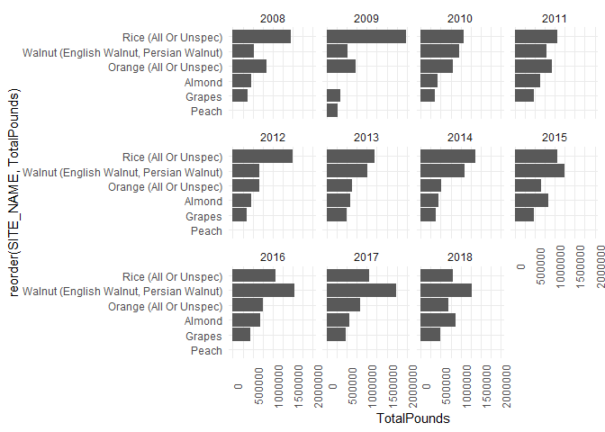<!-- -->


```r
# Overview histograms to explore the data a little bit
# This will help me narrow in on what story I want to tell with this dataset

# Histogram of total chem applied by month
ggplot(data = drop_na(yrMonCounty, APPLICATION_MONTH), aes(x = fct_rev(APPLICATION_MONTH), y = TotalPoundsChemAppl)) +
    geom_bar(stat = "identity") +
    coord_flip() +
    theme_minimal()
```

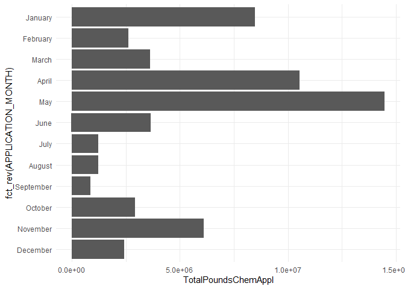<!-- -->


```r
# Overview histograms to explore the data a little bit
# This will help me narrow in on what story I want to tell with this dataset

# Line graph of total pounds applied in each year over time
# head(yrMonCounty)

# Including all counties illustrates much less change over time

yrMonCounty %>%
    group_by(COUNTY_NAME, YEAR) %>%
    summarize(TotalPounds = sum(TotalPoundsChemAppl)) %>%
#     group_by(YEAR) %>%
#     top_n(TotalPounds, n = 15) %>%
#     arrange(YEAR) %>%
    ggplot(aes(x = factor(YEAR), y = TotalPounds)) + 
    geom_point(alpha = 0.6) +
    stat_summary(aes(group = 1), fun.y = "mean", color = "red", size = 1, geom = "line") +
#     geom_boxplot(fill = NA) +
    theme_minimal()
```

```
## `summarise()` has grouped output by 'COUNTY_NAME'. You can override using the
## `.groups` argument.
```

```
## Warning: The `fun.y` argument of `stat_summary()` is deprecated as of ggplot2 3.3.0.
## ℹ Please use the `fun` argument instead.
```

```
## Warning: Using `size` aesthetic for lines was deprecated in ggplot2 3.4.0.
## ℹ Please use `linewidth` instead.
```

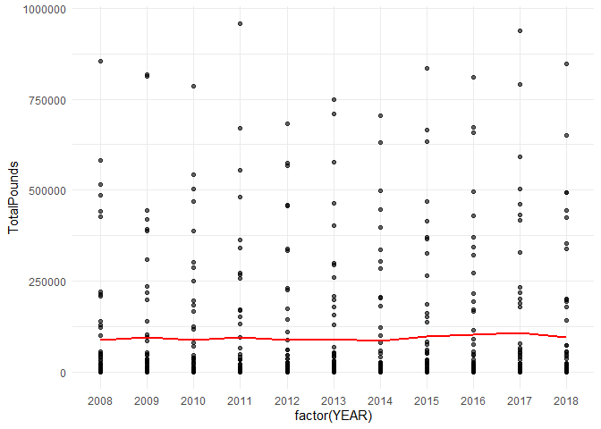<!-- -->

```r
# Using only the top 10 counties shows a bit more variation over time, but not much

yrMonCounty %>%
    group_by(COUNTY_NAME, YEAR) %>%
    summarize(TotalPounds = sum(TotalPoundsChemAppl)) %>%
    group_by(YEAR) %>%
    top_n(TotalPounds, n = 10) %>%
    arrange(YEAR) %>%
    ggplot(aes(x = factor(YEAR), y = TotalPounds)) + 
    geom_point(alpha = 0.6) +
    stat_summary(aes(group = 1), fun.y = "mean", color = "red", size = 1, geom = "line") +
#     geom_boxplot(fill = NA) +
    theme_minimal()
```

```
## `summarise()` has grouped output by 'COUNTY_NAME'. You can override using the
## `.groups` argument.
```

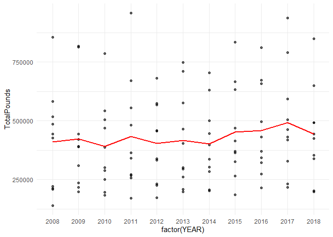<!-- -->

## Step 3: Create figures to use in the 'one-pager':
### - Choropleth, with shapefile outline of the San Joaquin Valley Air Basin


```r
# Choropleth Mapping: Data Preparation

# First, need to get CA county map data
CA <- map_data('county', 'california')
head(CA, 3)
```

```
##        long     lat group order     region subregion
## 1 -121.4785 37.4829     1     1 california   alameda
## 2 -121.5129 37.4829     1     2 california   alameda
## 3 -121.8853 37.4829     1     3 california   alameda
```

```r
# This is the dataframe that will be linked to the map data in order to plot it
# Yearly sums of pounds of copper-based chemical applied in each county
# head(yrMonCounty)

yrCounty <- yrMonCounty %>%
                group_by(COUNTY_NAME, YEAR) %>%
                summarize(TotalPounds = sum(TotalPoundsChemAppl))
```

```
## `summarise()` has grouped output by 'COUNTY_NAME'. You can override using the
## `.groups` argument.
```

```r
# Need to convert COUNTY_NAME from title case to lower case to match the map data
yrCounty$COUNTY_NAME <- str_to_lower(yrCounty$COUNTY_NAME)

head(yrCounty)
```

```
## # A tibble: 6 × 3
## # Groups:   COUNTY_NAME [1]
##   COUNTY_NAME  YEAR TotalPounds
##   <chr>       <int>       <dbl>
## 1 alameda      2008        47.3
## 2 alameda      2009        28.8
## 3 alameda      2010       221. 
## 4 alameda      2011      1059. 
## 5 alameda      2012      1326. 
## 6 alameda      2013      3867.
```

```r
# Trick: need to convert CA$region to equal CA$subregion so that ggplot will know that we want to plot based on counties, 
# otherwise, the 'region' section will be all 'california'
CA$region <- CA$subregion
head(CA)
```

```
##        long      lat group order  region subregion
## 1 -121.4785 37.48290     1     1 alameda   alameda
## 2 -121.5129 37.48290     1     2 alameda   alameda
## 3 -121.8853 37.48290     1     3 alameda   alameda
## 4 -121.8968 37.46571     1     4 alameda   alameda
## 5 -121.9254 37.45998     1     5 alameda   alameda
## 6 -121.9483 37.47717     1     6 alameda   alameda
```

```r
# Create a column for proportional amount of pounds applied
# This calculates what percent of the total pounds applied to a single county is of the total pounds applied to the 
# whole state.
yrCounty <- yrCounty %>%
                group_by(YEAR) %>%
                mutate(StateTotal = sum(TotalPounds)) %>%
                mutate(CountyProp = (TotalPounds/StateTotal)*100)

# arrange(yrCounty, desc(CountyProp)) # A check for myself just to look at the percentage data


# Create a new dataframe that contains a lat/long point location for my study site (lake basin)
SEKI <- data.frame(long = -118.667387, lat = 36.601038, name = "Sequoia National Park")
```


```r
# Creating dataframe for San Joaquin Air Basin from shapefile
library(rgdal)
```

```
## Loading required package: sp
```

```
## Please note that rgdal will be retired during 2023,
## plan transition to sf/stars/terra functions using GDAL and PROJ
## at your earliest convenience.
## See https://r-spatial.org/r/2022/04/12/evolution.html and https://github.com/r-spatial/evolution
## rgdal: version: 1.6-2, (SVN revision 1183)
## Geospatial Data Abstraction Library extensions to R successfully loaded
## Loaded GDAL runtime: GDAL 3.5.2, released 2022/09/02
## Path to GDAL shared files: C:/Users/gidge/AppData/Local/R/win-library/4.2/rgdal/gdal
## GDAL binary built with GEOS: TRUE 
## Loaded PROJ runtime: Rel. 8.2.1, January 1st, 2022, [PJ_VERSION: 821]
## Path to PROJ shared files: C:/Users/gidge/AppData/Local/R/win-library/4.2/rgdal/proj
## PROJ CDN enabled: FALSE
## Linking to sp version:1.5-1
## To mute warnings of possible GDAL/OSR exportToProj4() degradation,
## use options("rgdal_show_exportToProj4_warnings"="none") before loading sp or rgdal.
```

```r
library(maptools)
```

```
## Checking rgeos availability: TRUE
## Please note that 'maptools' will be retired during 2023,
## plan transition at your earliest convenience;
## some functionality will be moved to 'sp'.
```

```r
library(sf)
```

```
## Linking to GEOS 3.9.3, GDAL 3.5.2, PROJ 8.2.1; sf_use_s2() is TRUE
```


```r
# Creating dataframe for San Joaquin Air Basin from shapefile

# Read in the shapefile data (multiple files)
ab = readOGR(dsn="SJAB_GIS_Files/", layer="CaAirBasin")
# ab@proj4string
# class(ab) # This is a SpatialPolygonsDataFrame

# Convert from UTM coordinates to lat, long
# from: https://gis.stackexchange.com/questions/296170/r-shapefile-transform-longitude-latitude-coordinates
proj4string(ab)
ab_ll <- spTransform(ab, CRS("+proj=longlat +ellps=WGS84 +datum=WGS84"))
class(ab_ll) # This is a SpatialPolygonDataFrame
ab_ll@proj4string

# Merge geometry attributes and geometry features
# From: https://github.com/tidyverse/ggplot2/wiki/plotting-polygon-shapefiles
ab_ll@data$id <- rownames(ab_ll@data)
ab_ll_points <- fortify(ab_ll, region = "id")
head(ab_ll_points)
ab_ll_df <- left_join(ab_ll_points, ab_ll@data, by = "id")
# head(ab_ll_df[ab_ll_df$NAME == "San Joaquin Valley",])

# Extract only the data of interest, of the San Joaquin Valley Air Basin
sjab_df <- ab_ll_df[ab_ll_df$NAME == "San Joaquin Valley",]
head(sjab_df)

# help(spTransform)
```


```r
# New code bc above package is retiring
# st_read reads in the shapefile data 
setwd("C:/Users/gidge/OneDrive - University of Missouri/PhD Thesis Files/Data/CDPR Copper")
ab <- st_read(dsn="ca_air_basins/", layer="CaAirBasin")
```

```
## Reading layer `CaAirBasin' from data source 
##   `C:\Users\gidge\OneDrive - University of Missouri\PhD Thesis Files\Data\CDPR Copper\ca_air_basins' 
##   using driver `ESRI Shapefile'
## Simple feature collection with 15 features and 5 fields
## Geometry type: MULTIPOLYGON
## Dimension:     XY
## Bounding box:  xmin: -373976.8 ymin: -604526.1 xmax: 540015.4 ymax: 450070.9
## Projected CRS: TealeAlbersNAD83
```

```r
class(ab)
```

```
## [1] "sf"         "data.frame"
```

```r
# convert from MULTIPOLYGON to POLYGON
ab2 <- st_cast(ab, "POLYGON")
```

```
## Warning in st_cast.sf(ab, "POLYGON"): repeating attributes for all
## sub-geometries for which they may not be constant
```

```r
# Selects only the San Joaquin Valley Air Basin geometries
sjv <- ab2[ab2$NAME == "San Joaquin Valley",]$geometry

# check class 
class(sjv)
```

```
## [1] "sfc_POLYGON" "sfc"
```

```r
# convert to sf and data.frame
sjv_sf <- st_as_sf(sjv)

# recheck class
class(sjv_sf)
```

```
## [1] "sf"         "data.frame"
```

```r
# quick plot
plot(sjv_sf)
```

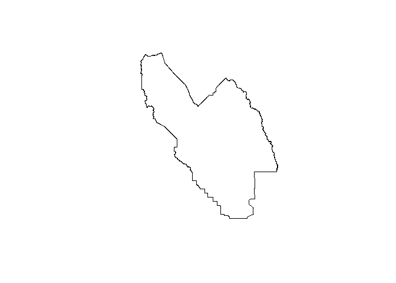<!-- -->

```r
# transform the coordinates from TealeAlbersNAD83 in UTMs to WGS84 in lat, long
sjv_sf_wgs84 <- st_transform(sjv_sf, crs = st_crs("WGS84"))

plot(sjv_sf_wgs84)
```

<!-- -->

```r
# This is the first level list of the sf data.frame:
head(sjv_sf_wgs84[[1]]) 
```

```
## Geometry set for 1 feature 
## Geometry type: POLYGON
## Dimension:     XY
## Bounding box:  xmin: -121.5846 ymin: 34.81111 xmax: -117.9805 ymax: 38.29992
## Geodetic CRS:  WGS 84
```

```
## POLYGON ((-121.0271 38.2999, -121.0241 38.29248...
```

```r
# This is the second list, printed in full.  (Ugly, don't run.)
# head(sjv_sf_wgs84[[1]][[1]]) 

# This is third level of listing in this object. 
# [,1] is the column of longitude values.  [,2] is the column of latitude values.
head(sjv_sf_wgs84[[1]][[1]][[1]]) 
```

```
##           [,1]     [,2]
## [1,] -121.0271 38.29990
## [2,] -121.0241 38.29248
## [3,] -121.0236 38.29131
## [4,] -121.0216 38.28630
## [5,] -121.0211 38.28508
## [6,] -121.0200 38.28277
```

```r
# So, use these in the ggplot to call out the long and lat.
head(sjv_sf_wgs84[[1]][[1]][[1]][,1])
```

```
## [1] -121.0271 -121.0241 -121.0236 -121.0216 -121.0211 -121.0200
```

```r
head(sjv_sf_wgs84[[1]][[1]][[1]][,2])
```

```
## [1] 38.29990 38.29248 38.29131 38.28630 38.28508 38.28277
```

```r
# Make a new dataframe of the sjvab long and lat to plot in ggplot
sjvab_coords <- data.frame(long = sjv_sf_wgs84[[1]][[1]][[1]][,1], lat = sjv_sf_wgs84[[1]][[1]][[1]][,2])
head(sjvab_coords)
```

```
##        long      lat
## 1 -121.0271 38.29990
## 2 -121.0241 38.29248
## 3 -121.0236 38.29131
## 4 -121.0216 38.28630
## 5 -121.0211 38.28508
## 6 -121.0200 38.28277
```


```r
# Choropleth Mapping: Plotting
# This is for 2018 only

############################
# Map of raw pounds applied
############################
# Opening graphical device
# png(filename="Choropleth_TotalPounds_D2.png", width = 700)

# Plot with application dataframe (2018 only), fill region with TotalPounds
ggplot() + 

# plot the copper pesticide data
# link COUNTY_NAME column from the data df (yrCounty) to the region column in the mapping df (CA)
geom_map(data = yrCounty[yrCounty$YEAR == 2018, ], map = CA, aes(map_id = COUNTY_NAME, fill = TotalPounds)) +

# plot the county lines second so they're on top of the colored counties
geom_map(data = CA, map = CA, aes(map_id = region), color = "black", fill = NA, size = 0.2) +

# plot the air basin outline, need to make it's own 'color' to add a legend of it
geom_path(data = sjvab_coords, aes(x = long, # longitude
                                   y = lat,  # latitude
                                   #group = group, 
                                   color = "sjab"), size = 1, show.legend = TRUE) +
scale_color_manual(values = c(sjab = "blue"), labels = c("San Joaquin Valley Air Basin")) + 

# plot point for my study site location, Tokopah Basin
geom_point(data = SEKI, aes(x = long, y = lat), shape = 18, color = "yellow", size = 4.5) +
geom_label(data = SEKI, aes(x = long, y = lat, label = str_wrap(name, width = 2)), alpha = 0.75, 
           nudge_x = 1, size = 4.5, show.legend = FALSE) +

# need to set limits of long (x) and lat (y) for map to display correctly
expand_limits(x = CA$long, y = CA$lat) +

# set axis to not have scientific notation, requires the 'scales' library
scale_fill_distiller(name = "Total Pounds",
                     labels = comma,
                     trans = "reverse", 
                     palette = "Oranges") +

# Add title to help identify maps, just for making drafts right now
labs(title = "2018 copper-based pesticide applications are concentrated in\ncounties of the San Joaquin Valley Air Basin") +

# Adjust elements of the legend
theme_void() +
guides(color = guide_legend(order = 1,
                           title = NULL,
                           label.theme = element_text(size = 14))) +
theme(legend.position = c(1, 0.75),
      plot.title = element_text(size = 18, face = "bold"),
      legend.title = element_text(size = 14),
      legend.text = element_text(size = 12)) +

# set coordinates and theme for display purposes
coord_map("polyconic")
```

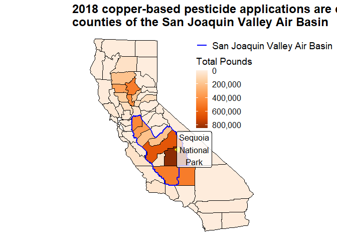<!-- -->

```r
# Close graphical device
# dev.off()


###############################################
# Map of raw pounds applied - NO TITLE CAPTION
###############################################
# Opening graphical device
# png(filename="Choropleth_TotalPounds_NoTitle_D2.png", width = 700)

# Plot with application dataframe (2018 only), fill region with TotalPounds
ggplot() + 

# plot the copper pesticide data
# link COUNTY_NAME column from the data df (yrCounty) to the region column in the mapping df (CA)
geom_map(data = yrCounty[yrCounty$YEAR == 2018, ], map = CA, aes(map_id = COUNTY_NAME, fill = TotalPounds)) +

# plot the county lines second so they're on top of the colored counties
geom_map(data = CA, map = CA, aes(map_id = region), color = "black", fill = NA, size = 0.2) +

# plot the air basin outline, need to make it's own 'color' to add a legend of it
geom_path(data = sjvab_coords, aes(x = long,
                                   y = lat,
                                   #group = group,
                                   color = "sjab"), size = 1, show.legend = TRUE) +
scale_color_manual(values = c(sjab = "blue"), labels = c("San Joaquin Valley Air Basin")) + 

# plot point for my study site location, Tokopah Basin
geom_point(data = SEKI, aes(x = long, y = lat), shape = 18, color = "yellow", size = 4.5) +
geom_label(data = SEKI, aes(x = long, y = lat, label = str_wrap(name, width = 2)), alpha = 0.75, 
           nudge_x = 1, size = 4.5, show.legend = FALSE) +

# need to set limits of long (x) and lat (y) for map to display correctly
expand_limits(x = CA$long, y = CA$lat) +

# set axis to not have scientific notation, requires the 'scales' library
scale_fill_distiller(name = "Total Pounds",
                     labels = comma,
                     trans = "reverse", 
                     palette = "Oranges") +

# Add title to help identify maps, just for making drafts right now
labs(title = NULL) +

# Adjust elements of the legend
theme_void() +
guides(color = guide_legend(order = 1,
                           title = NULL,
                           label.theme = element_text(size = 14))) +
theme(legend.position = c(1, 0.75),
      plot.title = element_text(size = 18, face = "bold"),
      legend.title = element_text(size = 14),
      legend.text = element_text(size = 12)) +

# set coordinates and theme for display purposes
coord_map("polyconic")
```

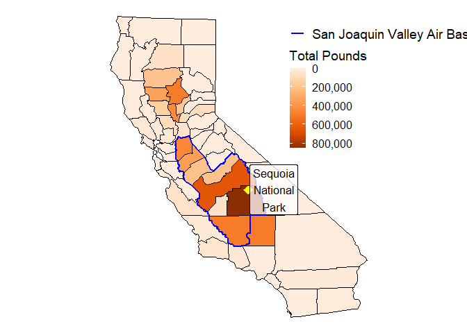<!-- -->

```r
# Close graphical device
# dev.off()


#####################################
# Map of proportional pounds applied
#####################################
# Opening graphical device
# png(filename="Choropleth_Percent_D1.png")

# Plot with application dataframe (2018 only), fill region with TotalPounds
ggplot() + 

# plot the copper pesticide data
# link COUNTY_NAME column from the data df (yrCounty) to the region column in the mapping df (CA)
geom_map(data = yrCounty[yrCounty$YEAR == 2018, ], map = CA, aes(map_id = COUNTY_NAME, fill = CountyProp)) +

# plot the county lines second so they're on top of the colored counties
geom_map(data = CA, map = CA, aes(map_id = region), color = "black", fill = NA, size = 0.2) +

# plot the air basin outline, need to make it's own 'color' to add a legend of it
geom_path(data = sjvab_coords, aes(x = long, 
                                   y = lat, 
                                   #group = group, 
                                   color = "sjab"), size = 1, show.legend = TRUE) +
scale_color_manual(name = "Air Basin", values = c(sjab = "blue"), labels = c("San Joaquin Valley")) + 

# plot point for my study site location, Tokopah Basin
geom_point(data = SEKI, aes(x = long, y = lat), shape = 18, color = "yellow", size = 3) +
geom_label(data = SEKI, aes(x = long, y = lat, label = str_wrap(name, width = 2)), alpha = 0.5, 
           nudge_x = 0.85, show.legend = FALSE) +

# need to set limits of long (x) and lat (y) for map to display correctly
expand_limits(x = CA$long, y = CA$lat) +

# set axis to not have scientific notation, requires the 'scales' library
scale_fill_distiller(name = "Percent",
                     labels = comma,
                     trans = "reverse",
                     palette = "Oranges") +

# Add title to help identify maps, just for making drafts right now
labs(title = "Pounds of Copper-Based Pesticides Applied per County, \nRepresented as Percent of State Total, 2018") +

# set coordinates and theme for display purposes
coord_map("polyconic") +
theme_void()
```

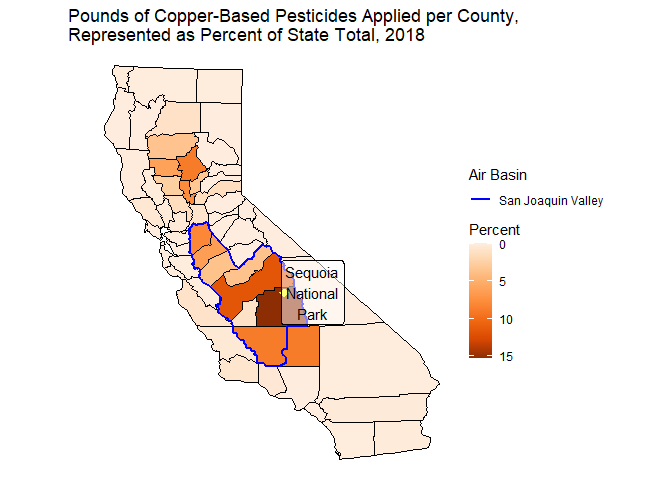<!-- -->

```r
# Close graphical device
# dev.off()
```

#### Calculation for one of the annotations in the 'one-pager':


```r
# Annotations: 
# Calculating percent of copper-based pesticides applied in counties within the SJV Air Basin
head(yrCounty[yrCounty$YEAR == 2018,])
```

```
## # A tibble: 6 × 5
## # Groups:   YEAR [1]
##   COUNTY_NAME  YEAR TotalPounds StateTotal CountyProp
##   <chr>       <int>       <dbl>      <dbl>      <dbl>
## 1 alameda      2018        493.   5517621.    0.00893
## 2 alpine       2018          0    5517621.    0      
## 3 amador       2018       1427.   5517621.    0.0259 
## 4 butte        2018     492363.   5517621.    8.92   
## 5 calaveras    2018       1740.   5517621.    0.0315 
## 6 colusa       2018     142546.   5517621.    2.58
```

```r
SJVABPounds <- 
yrCounty[yrCounty$YEAR == 2018 & 
         (yrCounty$COUNTY_NAME == "san joaquin" | 
          yrCounty$COUNTY_NAME == "stanislaus" | 
          yrCounty$COUNTY_NAME == "merced" |
          yrCounty$COUNTY_NAME == "madera" |
          yrCounty$COUNTY_NAME == "fresno" |
          yrCounty$COUNTY_NAME == "kings" |
          yrCounty$COUNTY_NAME == "tulare" |
          yrCounty$COUNTY_NAME == "kern"), ] %>%
    summarize(SJVABPounds = sum(TotalPounds))

StateTotal2018 <- yrCounty[yrCounty$YEAR == 2018,] %>% summarize(StateTotal = sum(TotalPounds))

SJVABPounds
```

```
## # A tibble: 1 × 2
##    YEAR SJVABPounds
##   <int>       <dbl>
## 1  2018    3240712.
```

```r
StateTotal2018
```

```
## # A tibble: 1 × 2
##    YEAR StateTotal
##   <int>      <dbl>
## 1  2018   5517621.
```

```r
# Calculate percent of pesticides applied in SJVAB counties
(SJVABPounds$SJVABPounds/StateTotal2018$StateTotal)*100
```

```
## [1] 58.73385
```

```r
3240712/5517621*100
```

```
## [1] 58.73386
```

```r
# From this, I will add a small annotation that states that the counties that make up the SJV Air Basin account for 59% of
# the entire state's application of copper-based pesticides in 2018.
```


```r
# head(yrMonCounty[yrMonCounty$YEAR == 2018,])

SJVABPounds2 <- 
yrMonCounty[yrMonCounty$YEAR == 2018 & 
         (yrMonCounty$COUNTY_NAME == "San Joaquin" | 
          yrMonCounty$COUNTY_NAME == "Stanislaus" | 
          yrMonCounty$COUNTY_NAME == "Merced" |
          yrMonCounty$COUNTY_NAME == "Madera" |
          yrMonCounty$COUNTY_NAME == "Fresno" |
          yrMonCounty$COUNTY_NAME == "Kings" |
          yrMonCounty$COUNTY_NAME == "Tulare" |
          yrMonCounty$COUNTY_NAME == "Kern"),] %>%
    group_by(YEAR) %>% # need to do this to prevent automatic grouping by application month
    summarize(SJVABPounds = sum(TotalPoundsChemAppl))


StateTotal2018 <- yrMonCounty[yrMonCounty$YEAR == 2018,] %>% 
                    group_by(YEAR) %>%
                    summarize(StateTotal = sum(TotalPoundsChemAppl))

SJVABPounds
```

```
## # A tibble: 1 × 2
##    YEAR SJVABPounds
##   <int>       <dbl>
## 1  2018    3240712.
```

```r
SJVABPounds2 # These are the same...good!
```

```
## # A tibble: 1 × 2
##    YEAR SJVABPounds
##   <int>       <dbl>
## 1  2018    3240712.
```

```r
StateTotal2018
```

```
## # A tibble: 1 × 2
##    YEAR StateTotal
##   <int>      <dbl>
## 1  2018   5517621.
```

```r
# Calculate percent of pesticides applied in SJVAB counties
(SJVABPounds$SJVABPounds/StateTotal2018$StateTotal)*100
```

```
## [1] 58.73385
```

```r
3240712/5517621*100
```

```
## [1] 58.73386
```

### - Line graph (trends across years)


```r
# Side graph #1
# Line graph of mean+/- SE pounds applied in each year over time
# create one line that is whole state, and second line that is counties in SJVAB

# head(yrMonCounty)
# First, I'm going to create a dataframe that will be easier to work with, instead of having to summarize everything
# within the ggplot coding chunks

YrSums <- yrMonCounty %>%
                group_by(YEAR) %>%
                summarize(StateTotal = sum(TotalPoundsChemAppl))
# YrSums

SJVABSums <- yrMonCounty[yrMonCounty$COUNTY_NAME == "San Joaquin" | yrMonCounty$COUNTY_NAME == "Stanislaus" | 
             yrMonCounty$COUNTY_NAME == "Merced" | yrMonCounty$COUNTY_NAME == "Madera" |
             yrMonCounty$COUNTY_NAME == "Fresno" | yrMonCounty$COUNTY_NAME == "Kings" |
             yrMonCounty$COUNTY_NAME == "Tulare" | yrMonCounty$COUNTY_NAME == "Kern", ] %>%
                group_by(YEAR) %>%
                summarize(SJVABTotal = sum(TotalPoundsChemAppl))
# SJVABSums

YrSums <- left_join(x = YrSums, y = SJVABSums, by = "YEAR")
YrSums2 <- pivot_longer(data = YrSums, cols = c(StateTotal, SJVABTotal), names_to = "Grouping", values_to = "Pounds")
YrSums2$Grouping <- factor(YrSums2$Grouping, levels = c("StateTotal", "SJVABTotal"))
head(YrSums2)
```

```
## # A tibble: 6 × 3
##    YEAR Grouping     Pounds
##   <int> <fct>         <dbl>
## 1  2008 StateTotal 4947920.
## 2  2008 SJVABTotal 2580850.
## 3  2009 StateTotal 5101113.
## 4  2009 SJVABTotal 2288006.
## 5  2010 StateTotal 4844894.
## 6  2010 SJVABTotal 2702536.
```

```r
##############################################
# Line Graph Showing Pounds Applied Over Time
##############################################
# Opening graphical device
# png(filename="LineGraph_PoundsOverTime_D1.png", width = 1300)


# Now, make line graph showing copper-based pesticide use over time in CA and SJVAB Counties
ggplot(data = YrSums2) +
    geom_line(aes(x = factor(YEAR), y = Pounds, color = Grouping, group = Grouping), size = 3) +     

# clean up labels, axes, legend
labs(x = NULL, y = "Total Pounds Copper-based\nPesticides Applied\n") +
scale_y_continuous(labels = comma) +
scale_color_manual(name = NULL, values = c("black", "blue"), 
                   labels = c("Statewide", "San Joaquin Valley Air Basin"),
                   guide = guide_legend(nrow = 1)) +
theme_classic() +
theme(legend.position = "top",
      axis.text.y = element_text(size = 19),
      axis.text.x = element_text(size = 22, color = "black", face = "bold"),
      axis.title = element_text(size = 23, face = "bold"),
      legend.text = element_text(size = 20),
      panel.grid.major.y = element_line(color = "lightgrey"))
```

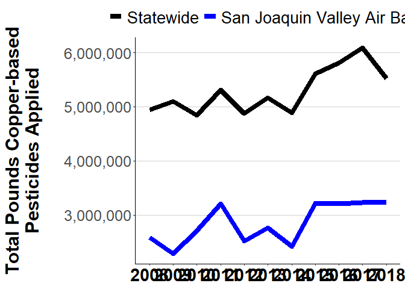<!-- -->

```r
# dev.off()
```

### - Boxplot (trends across months)


```r
# Side Graph # 2
# Boxplot of Monthly Pesticide Applications
# Not sure if I want to do boxplot of the whole state, or boxplot of just SJVAB counties...

# head(yrMonCounty)

# Dataframe of monthly total statewide applications
MonthSums <- yrMonCounty %>%
                drop_na(APPLICATION_MONTH) %>%
                group_by(APPLICATION_MONTH, YEAR) %>%
                summarize(StateMonthTotal = sum(TotalPoundsChemAppl))
```

```
## `summarise()` has grouped output by 'APPLICATION_MONTH'. You can override using
## the `.groups` argument.
```

```r
# Change months to abbreviations for graphing clarity
MonthSums$APPLICATION_MONTH <- factor(month.abb[MonthSums$APPLICATION_MONTH], 
                                      levels = c("Jan", "Feb", "Mar", "Apr", "May", "Jun", 
                                                 "Jul", "Aug", "Sep", "Oct", "Nov", "Dec"))
# head(MonthSums, 3)

# Dataframe of monthly total applications for counties of SJVAB only
SJVABMonthSums <- yrMonCounty[yrMonCounty$COUNTY_NAME == "San Joaquin" | yrMonCounty$COUNTY_NAME == "Stanislaus" | 
                              yrMonCounty$COUNTY_NAME == "Merced" | yrMonCounty$COUNTY_NAME == "Madera" |
                              yrMonCounty$COUNTY_NAME == "Fresno" | yrMonCounty$COUNTY_NAME == "Kings" |
                              yrMonCounty$COUNTY_NAME == "Tulare" | yrMonCounty$COUNTY_NAME == "Kern", ] %>%
                group_by(APPLICATION_MONTH, YEAR) %>%
                summarize(SJVABMonthTotal = sum(TotalPoundsChemAppl))
```

```
## `summarise()` has grouped output by 'APPLICATION_MONTH'. You can override using
## the `.groups` argument.
```

```r
# Change months to abbreviations for graphing clarity
SJVABMonthSums$APPLICATION_MONTH <- factor(month.abb[SJVABMonthSums$APPLICATION_MONTH], 
                                           levels = c("Jan", "Feb", "Mar", "Apr", "May", "Jun", 
                                                      "Jul", "Aug", "Sep", "Oct", "Nov", "Dec"))

# head(SJVABMonthSums, 3)


#########################################################
# Boxplot showing monthly applications, SJVAB, Annotated
#########################################################
# Boxplot of SJVAB counties only, going with this because it's more relevant to my data story
# Opening graphical device
# png(filename="Boxplot_SJVABMonthly_ANNO_D1.png", width = 600, height = 500)

ggplot(data = SJVABMonthSums) +
# Plot the boxplots to show variation in application amounts per month from 2008 to 2018
# remove outliers because will display raw points
geom_boxplot(aes(x = APPLICATION_MONTH, y = SJVABMonthTotal), fill = "#fee6ce",
             width = 0.8, outlier.shape = NA) + 

# Plot raw points, with some jitter
geom_point(aes(x = APPLICATION_MONTH, y = SJVABMonthTotal), color = "#d94801", alpha = 0.4,
              position = position_jitter(width = 0.15)) +

# Plot annotation, arrows first
# Add arrows first
annotate(geom = "segment", x = 7.5, xend = 4.1,
         y = 770000, yend = 590000, arrow = arrow(), size = 1.2) +
annotate(geom = "segment", x = 9, xend = 7.75,
         y = 770000, yend = 210000, arrow = arrow(), size = 1.2) +

# Plot text box so it covers up the arrows
annotate(geom = "label", x = 7.75, y = 770000, fill = "#fff5eb", size = 5, 
         label.padding = unit(0.75, "lines"), label.size = 1.2, label.r = unit(0.5, "lines"),
         label = "Most applications are made in\nthe winter and spring. Much\nless is applied in summer.") +


# Clean up labels, axes, etc. AFTER theme_classi() to avoid overwriting
scale_y_continuous(labels = comma) +
labs(x = NULL, y = "Pounds of Copper-based Pesticides Applied\n",
     title = "San Joaquin Valley Air Basin:\nMonthly Applications, 2008 - 2018") +
theme_classic() +
theme(axis.title.y = element_text(size = 18, face = "bold"),
      axis.text.y = element_text(size = 13),
      axis.text.x = element_text(size = 17, color = "black", face = "bold"),
      plot.title = element_text(size = 20, face = "bold", hjust = 0.5),
      panel.grid.major.y = element_line(color = "lightgrey"))
```

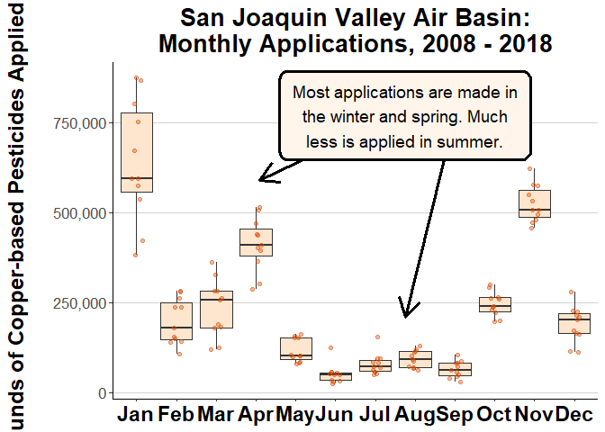<!-- -->

```r
# dev.off()


#############################################################
# Boxplot showing monthly applications, SJVAB, NOT Annotated
#############################################################
# Boxplot without annotated text box 
# png(filename="Boxplot_SJVABMonthly_D1.png", width = 600)

ggplot(data = SJVABMonthSums) +
# Plot the boxplots to show variation in application amounts per month from 2008 to 2018
# remove outliers because will display raw points
geom_boxplot(aes(x = APPLICATION_MONTH, y = SJVABMonthTotal), fill = "#fee6ce",
             width = 0.8, outlier.shape = NA) + 

# Plot raw points, with some jitter
geom_point(aes(x = APPLICATION_MONTH, y = SJVABMonthTotal), color = "#d94801", alpha = 0.4, 
           position = position_jitter(width = 0.15)) +

# Clean up labels, axes, etc. AFTER theme_classic() to avoid overwriting
scale_y_continuous(labels = comma) +
labs(x = NULL, y = "Pounds of Copper-based Pesticides Applied\n",
     title = "San Joaquin Valley Air Basin:\nMonthly Applications, 2008 - 2018") +
theme_classic() +
theme(axis.title.y = element_text(size = 18, face = "bold"),
      axis.text.y = element_text(size = 13),
      axis.text.x = element_text(size = 17, color = "black", face = "bold"),
      plot.title = element_text(size = 20, face = "bold", hjust = 0.5),
      panel.grid.major.y = element_line(color = "lightgrey"))
```

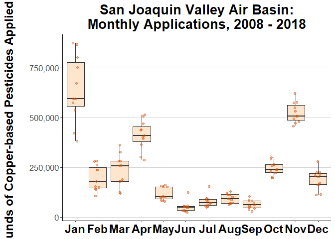<!-- -->

```r
# dev.off()
```

### - Bar graph (top crops)


```r
# Side Graph # 3
# Horizontal Bar Chart of top 5 crops with most pesticides used statewide
# Need to use Mean and SE

# head(yrMonCountyChemCrop)

#Statewide dataframe of summarized data
StateCrops <- yrMonCountyChemCrop %>%
                    drop_na(SITE_NAME) %>%
                    group_by(SITE_NAME, YEAR) %>%
                    summarize(TotalPounds = sum(TotalPoundsChemAppl))
```

```
## `summarise()` has grouped output by 'SITE_NAME'. You can override using the
## `.groups` argument.
```

```r
#                     group_by(YEAR) %>%
#                     filter(YEAR == 2010) %>%
#                     top_n(TotalPounds, n = 5)

# head(StateCrops[StateCrops$SITE_NAME == "Almond", ]) # This is a check for myself
# dim(StateCrops)


# SJVAB Counties only dataframe of summarized data
SJVABCrops <- yrMonCountyChemCrop[yrMonCountyChemCrop$COUNTY_NAME == "San Joaquin" | yrMonCountyChemCrop$COUNTY_NAME == "Stanislaus" | 
                                  yrMonCountyChemCrop$COUNTY_NAME == "Merced" | yrMonCountyChemCrop$COUNTY_NAME == "Madera" |
                                  yrMonCountyChemCrop$COUNTY_NAME == "Fresno" | yrMonCountyChemCrop$COUNTY_NAME == "Kings" |
                                  yrMonCountyChemCrop$COUNTY_NAME == "Tulare" | yrMonCountyChemCrop$COUNTY_NAME == "Kern", ] %>%
                    drop_na(SITE_NAME) %>%
                    drop_na(YEAR) %>%
                    group_by(SITE_NAME, YEAR) %>%
                    summarize(TotalPounds = sum(TotalPoundsChemAppl))
```

```
## `summarise()` has grouped output by 'SITE_NAME'. You can override using the
## `.groups` argument.
```

```r
#                     group_by(YEAR) %>%
#                     filter(YEAR == 2010) %>%
#                     top_n(TotalPounds, n = 5)

# head(SJVABCrops[SJVABCrops$SITE_NAME == "Almond", ]) # This is a check for myself
# dim(SJVABCrops)


####################################################################
# Bar graph showing Mean +/- SE of application per Top Crops, SJVAB
####################################################################

# Bar graph top crops, STATEWIDE 
# png(filename="BarGraph_TopCrops_SJVAB_D1.png", width = 600)

SJVABCropsTop <- SJVABCrops %>% drop_na(YEAR) %>% group_by(YEAR) %>% top_n(TotalPounds, n = 5)
# SJVABCropsTop

ggplot(data = SJVABCropsTop, aes(x = reorder(SITE_NAME, TotalPounds), y = TotalPounds)) +
stat_summary(fun.y = "mean", geom = "bar", aes(fill = ..y..), width = 0.9, show.legend = FALSE) +
stat_summary(fun.data = "mean_se", geom = "errorbar", width = 0.4, size = 0.5) +
scale_x_discrete(labels = c("Peaches", "Wine Grapes", "Tangerines", "Walnuts", "Grapes", "Almonds", "Oranges")) + 
scale_y_continuous(name = "\nPounds of Copper-based Pesticides Applied\n(Mean ± SE), 2008-2018",
                   labels = comma, expand = c(0,0)) +
scale_fill_distiller(palette = "Oranges",
                     trans = "reverse") +
coord_flip() + 
theme_classic() +
labs(x = NULL) +
theme(axis.text.y = element_text(size = 15, color = "black", face = "bold"),
      axis.title.x = element_text(size = 15, face = "bold"),
      axis.text.x = element_text(size = 13),
      panel.grid.major.x = element_line(color = "lightgrey"))
```

```
## Warning: The dot-dot notation (`..y..`) was deprecated in ggplot2 3.4.0.
## ℹ Please use `after_stat(y)` instead.
```

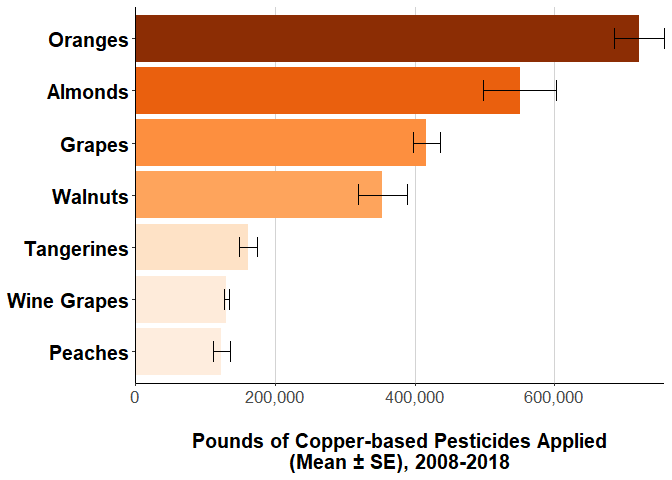<!-- -->

```r
# dev.off()

########################################################################
# Bar graph showing Mean +/- SE of application per Top Crops, Statewide
########################################################################

# Bar graph top crops, STATEWIDE 
# png(filename="BarGraph_TopCrops_Statewide_D1.png",width = 600)

StateCropsTop <- StateCrops %>% drop_na(YEAR) %>% group_by(YEAR) %>% top_n(TotalPounds, n = 5)
# head(StateCropsTop)

ggplot(data = StateCropsTop, aes(x = reorder(SITE_NAME, TotalPounds), y = TotalPounds)) +
stat_summary(fun.y = "mean", geom = "bar", aes(fill = ..y..), width = 0.9, show.legend = FALSE) +
stat_summary(fun.data = "mean_se", geom = "errorbar", width = 0.4, size = 0.5) +
scale_x_discrete(labels = c("Peaches", "Grapes", "Almonds", "Oranges", "Walnuts", "Rice")) + 
scale_y_continuous(name = "\nPounds of Copper-based Pesticides Applied\n(Mean ± SE), 2008-2018",
                   labels = comma, expand = c(0,0)) +
scale_fill_distiller(palette = "Oranges",
                     trans = "reverse") +
coord_flip() + 
theme_classic() +
labs(x = NULL) +
theme(axis.text.y = element_text(size = 15, color = "black", face = "bold"),
      axis.title.x = element_text(size = 15, face = "bold"),
      axis.text.x = element_text(size = 13),
      panel.grid.major.x = element_line(color = "lightgrey"))
```

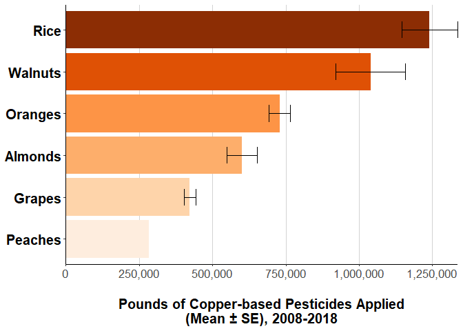<!-- -->

```r
# dev.off()
```

---

# Common Pitfalls / Inefficiencies

**BEFORE you submit your end product, pay attention to the following and check your visualizations and story accordingly:**

---

### - Remember the design analysis questions:

**what, how, who, why?** 

- What are you showing/telling? 
- How are you going to show it (efficiency? visual tasks like comparison, trends, query, etc.) 
- Who is your audience? Why should they care about what you have to tell? What are the **actionable** information they can take from your story? 
- Why are you telling the story? What is your angle, message, point? (make it clear in text AND visuals) 

---

### - Pay attention to the color schemes/palettes:

 - Do NOT use sequential palettes for data attributes that have no ordering.
 - Do NOT use qualitative color schemes for attributes where order matters. 

---

###  - Color coordinate among plots so that the same data attributes have the same color in all plots:

You can do that by creating a manual palette and use it everywhere to make sure same color is always assigned to the same attribute value (especially important for categories). Do not change color of the same category among plots!

---

###  - Perceptual grouping is important! group and/or order values:

People tend to make sense of things and compare better when they are ordered or grouped:  

- In a bar chart, **order the axes** by time, value, etc. to make comparisons more intuitive. 

- Pie chart: order wedges. 

- In a bubble map, if you want to show trends, use grouping variable to **connect** bubbles, etc. 

---

### - No lengthy text in x axis:

- **Flip** the axes of a bar chart so that character values (text) are **readable on the y axis** left to right, 

**or** 

- at least, put them slanted in x axis for better readibility. 

---

### - Plot only those data columns and/or subsets that tell an obvious story:

 - **No crowded** scatter plots with useless linear regression lines that don't tell anything.  
 - You do **NOT** have to plot **ALL** your data (most of the time, you should not). 
 - Look at alternative plots to tell your story effectively. 
 - Your plots should be perceived easily and intuitively. 
  
  

---

### - If you have too many classes (discrete variables/categories), try to GROUP them:

- Instead of giving a color to each of the dozen or so categories, you can put them in meaningful groups and color code to reduce clutter. 

- For sequential variables, you can do the same thing by **binning** numbers into bins (like in a histogram). 

- **Stepped color palettes** may be more useful than smooth sequential palettes (especially for comparison in choropleth maps) for a large range of values in an attribute. 

- You can **group/cluster data into meaningful chunks** and display those as bubble charts, networks, geographical regions, etc. 

- Do **NOT** dump all the data in the plot unless there is a CLEAR pattern/clustering to it that can be **perceived immediately**. 

---

### - ANNOTATE! ANNOTATE! ANNOTATE!

- **Tell** your audience what they are supposed to see. 

- Use **meaningful** titles with a message/statement, no dry titles. 

- Use nice and concise axis labels (make sure they are large enough).

- Use text annotations (look at the **examples in the lab notebook**).

---

### - THEMING

- **Good looking** charts are more **convincing**! Your audience will have more confidence in your work. 

- **Almost NEVER use the default color palette, default theme, or default fonts.**

- Use a subtle color scheme, nice fonts, interesting glyphs, etc. to make your charts look more **sophisticated**. 

---

### - Use space wisely!

- **Balance the plots** to use space effectively.

- Pay attention to **data-ink ratio**.

- **HAVE A FLOW left to right, top to bottom**. 

- If you must have a line plot or bar plot with a lot of empty space, try to put text annotations with relevant information in them. 
